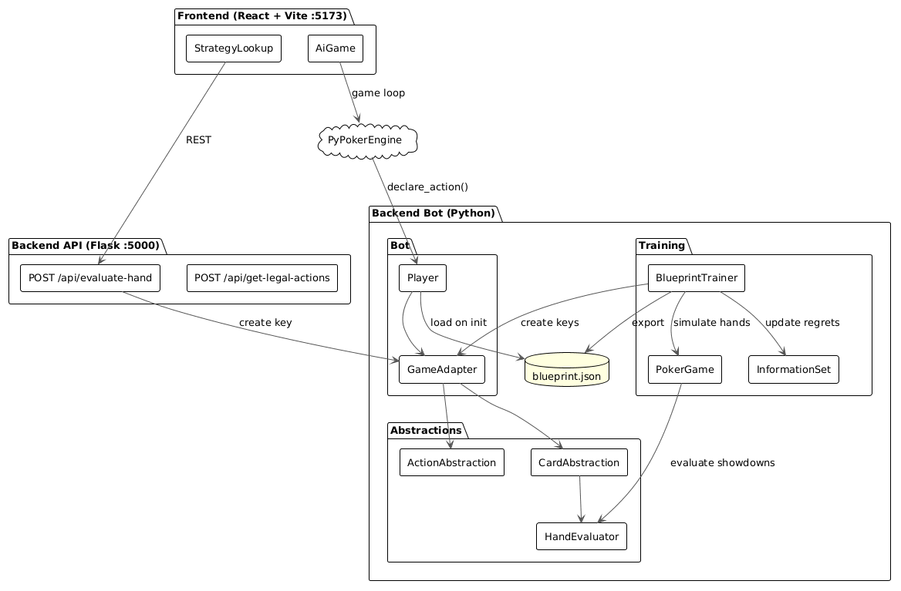
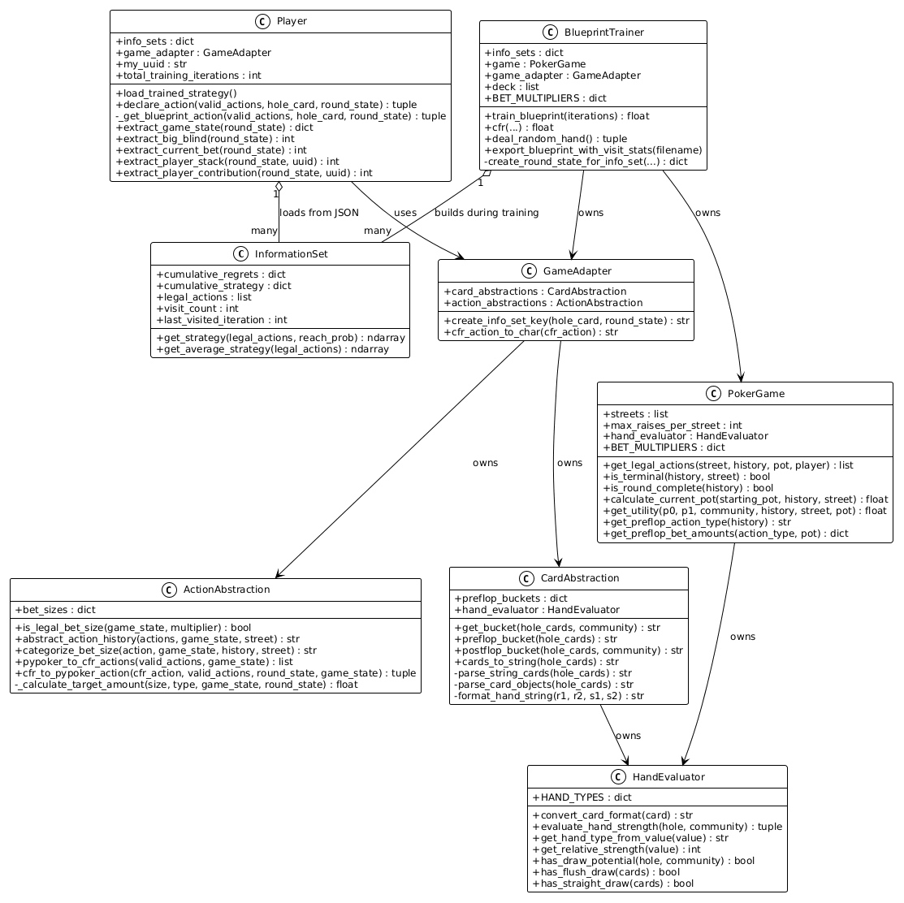
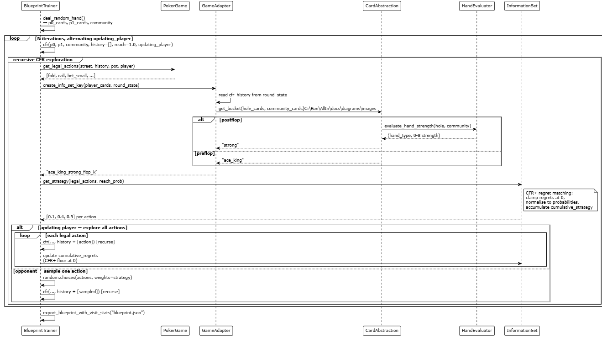
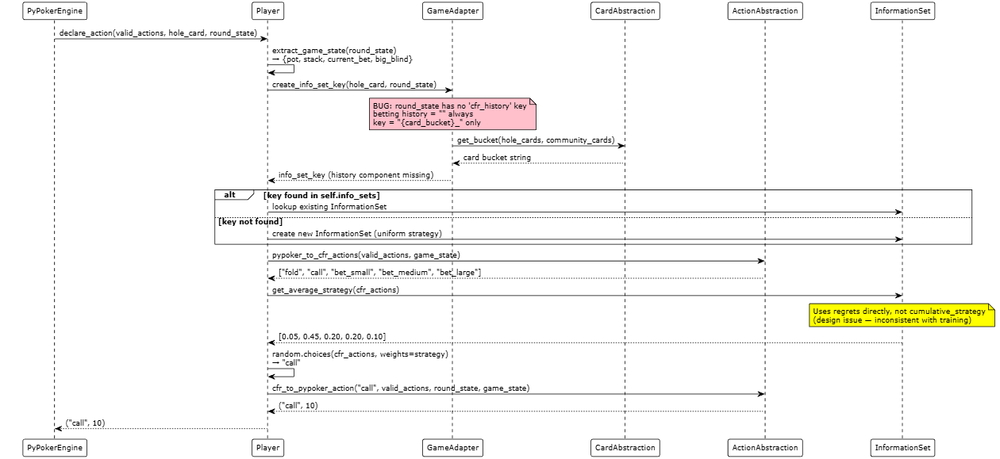
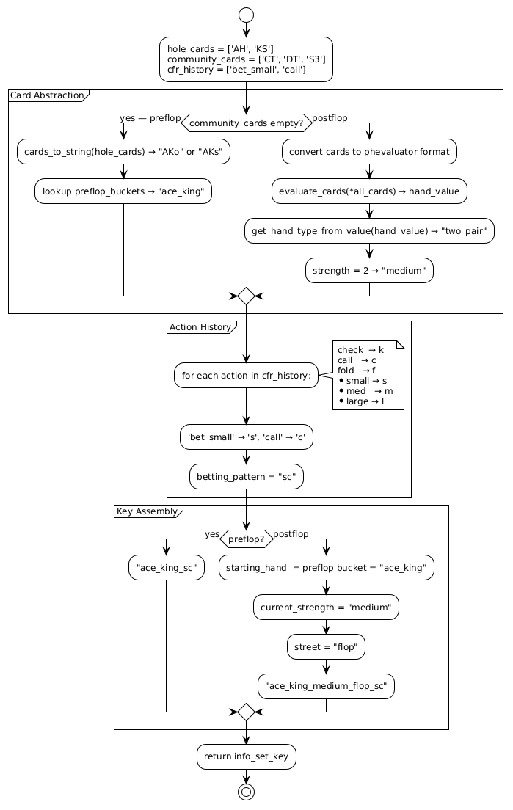

# AllIn — Developer Guide

> **Audience**: Anyone returning to this codebase after time away, or a new contributor.  
> This guide explains what every module does, how data flows through the system, and the known bugs / design issues that need to be fixed before the bot works correctly in live play.

---

## Table of Contents

1. [What Is AllIn?](#1-what-is-allin)
2. [Repository Structure](#2-repository-structure)
3. [Core Concepts](#3-core-concepts)
4. [Module Reference](#4-module-reference)
5. [Data Flow: Training](#5-data-flow-training)
6. [Data Flow: Inference (Live Play)](#6-data-flow-inference-live-play)
7. [The Info Set Key — How It Works](#7-the-info-set-key--how-it-works)
8. [Blueprint JSON — Schema Reference](#8-blueprint-json--schema-reference)
9. [Known Bugs and Design Issues](#9-known-bugs-and-design-issues)
10. [PlantUML Diagrams](#10-plantuml-diagrams)

---

## 1. What Is AllIn?

AllIn is a heads-up (2-player) No-Limit Texas Hold'em poker AI built around **CFR+ (Counterfactual Regret Minimization Plus)**. It has three layers:

| Layer | Stack | Role |
|---|---|---|
| Training | Python (CFR+) | Runs thousands of simulated poker games, accumulates regrets, and converges on a near-optimal strategy table |
| Bot | Python (PyPokerEngine) | Loads the trained strategy table and plays live games by looking up the current situation |
| UI / API | React + Flask | Interactive strategy explorer and live game frontend |

The strategy the training phase produces is called the **blueprint**. It is a lookup table: given a compact description of the current game situation (the *information set key*), it returns a probability distribution over actions (fold 10%, call 45%, bet 45%). The bot samples from that distribution to play.

---

## 2. Repository Structure

```
AllIn/
├── backend/
│   ├── bot/
│   │   ├── src/
│   │   │   ├── abstractions/
│   │   │   │   ├── card_abstractions.py   # Bucket hands into categories
│   │   │   │   ├── action_abstractions.py # Bucket bet sizes, convert formats
│   │   │   │   └── hand_evaluator.py      # Wrap phevaluator C library
│   │   │   ├── bot/
│   │   │   │   ├── player.py              # PyPokerEngine player — live bot
│   │   │   │   └── game_adapter.py        # Bridge: PyPokerEngine ↔ CFR formats
│   │   │   └── cfr/
│   │   │       ├── blueprint_trainer.py   # CFR+ training loop
│   │   │       ├── information_set.py     # Per-situation regret/strategy storage
│   │   │       └── poker_game.py          # Lightweight poker rules for training
│   │   ├── analysis/
│   │   │   └── blueprint.json            # Pre-trained strategy (output of trainer)
│   │   └── tests/
│   │       └── test_player.py
│   └── api/
│       └── strategy_api.py               # Flask REST API
└── frontend/
    └── src/
        ├── pages/
        │   ├── StrategyLookup.jsx
        │   └── AiGame.jsx
        └── components/
```

---

## 3. Core Concepts

### CFR+ (Counterfactual Regret Minimization Plus)

CFR is a family of algorithms that learns game-theoretically optimal strategies by repeatedly playing a game against itself and tracking *regret* — the difference between what a player got and what they could have gotten if they had played a different action.

After enough iterations, the **average strategy** (the time-average of all strategies computed during training) converges to a Nash equilibrium. CFR+ is a variant that clamps regrets at zero, which speeds convergence.

**Key properties:**
- Works on the full game tree — it doesn't need hand-crafted heuristics
- Requires the game to be abstracted (simplified) to be tractable — this is what the abstraction modules do
- Outputs a strategy *per information set*, not per hand — the same key can represent many concrete game states

### Information Sets

In poker, a player can't see their opponent's cards. An *information set* is everything the current player **can** observe:
- Their own hole cards (abstracted to a bucket)
- The community cards (abstracted to a strength bucket)
- The history of actions this hand

Two concrete game states are in the same information set if they look identical to the current player. The CFR algorithm stores one strategy entry per information set key.

### Card Abstraction

Full poker has 1,755 distinct preflop hand types and millions of postflop situations. We reduce this by bucketing:

**Preflop buckets** (8):
`premium_pair` (AA/KK/QQ) · `medium_pair` (JJ–99) · `small_pair` (88–22) · `ace_king` · `strong_ace` (AQ/AJ/AT) · `ace_x` (A9–A2) · `broadway` (KQ–JT) · `suited_connector` (T9s–54s) · `weak` (everything else)

**Postflop buckets** (6):
`monster` (quads+) · `strong` (flush/full house/straight) · `medium` (trips/two pair) · `weak_made` (pair) · `draw` (flush or straight draw) · `bluff` (high card, no draw)

### Action Abstraction

Real bet sizes are infinite. We collapse them into three:
- `small` = 33% of pot
- `medium` = 66% of pot
- `large` = 100% of pot (pot-sized)

Preflop uses fixed BB-based sizes: opens (3/5/7 BB), 3-bets (6/10/14 BB), and pot-relative (66%/133%/200%) for 4-bet+.

Action history is encoded as a compact string of single characters: `k`=check, `c`=call, `f`=fold, `s`=bet/raise small, `m`=bet/raise medium, `l`=bet/raise large.

### The Blueprint

The output of training is `blueprint.json`. It maps each information set key (a string like `"ace_king_strong_flop_k"`) to:
- `average_strategy` — the probability distribution over actions
- `regrets` — raw CFR regret values per action
- `visit_count` / `last_visited_iteration` — training coverage metadata

---

## 4. Module Reference

### `abstractions/hand_evaluator.py` — `HandEvaluator`

**Purpose:** Evaluate the absolute strength of a poker hand.

Wraps the `phevaluator` C library, which uses pre-computed lookup tables for O(1) evaluation. The card format used by PyPokerEngine (`'CT'` = Club Ten, suit-first) must be converted to phevaluator format (`'Tc'` = Ten of clubs, rank-first) before calling.

**Key methods:**
- `evaluate_hand_strength(hole_cards, community_cards)` — returns `(hand_type_string, 0–8_integer_strength)`
- `has_draw_potential(hole_cards, community_cards)` — returns `True` if 4+ flush or straight outs
- `convert_card_format(card)` — converts `'CT'` → `'Tc'`

**Card format note:** PyPokerEngine format is `[Suit][Rank]`: `'C'`=Clubs, `'H'`=Hearts, `'D'`=Diamonds, `'S'`=Spades. Rank is the second character: `'T'`=Ten, `'J'`/`'Q'`/`'K'`/`'A'` for face cards, `'2'`–`'9'` for number cards.

---

### `abstractions/card_abstractions.py` — `CardAbstraction`

**Purpose:** Map a concrete hand to a bucket string used in info set keys.

Uses `HandEvaluator` for postflop strength. Preflop bucketing is a table lookup against hand strings like `'AKs'` (Ace-King suited) or `'AKo'` (offsuit).

**Key methods:**
- `get_bucket(hole_cards, community_cards)` — routes to preflop or postflop
- `preflop_bucket(hole_cards)` — looks up hand string in `preflop_buckets` dict
- `postflop_bucket(hole_cards, community_cards)` — calls HandEvaluator, maps strength 0–8 to bucket name
- `cards_to_string(hole_cards)` — handles both PyPokerEngine string cards and Card objects

**⚠️ Bug:** `parse_string_cards` reads `card[0]` as rank and `card[1]` as suit. PyPokerEngine format is the opposite — `card[0]` is suit, `card[1]` is rank. The preflop bucket lookup produces wrong hand strings as a result. See [§9](#9-known-bugs-and-design-issues).

---

### `abstractions/action_abstractions.py` — `ActionAbstraction`

**Purpose:** Convert between PyPokerEngine's action format and the CFR abstracted action format, and calculate bet amounts.

This is the translation layer that bridges the two incompatible representations of poker actions. PyPokerEngine uses `{'action': 'raise', 'amount': {'min': 4, 'max': 200}}`. CFR uses `'raise_small'`, `'raise_medium'`, `'raise_large'`.

**Key methods:**
- `pypoker_to_cfr_actions(valid_actions, game_state)` — converts PyPokerEngine's legal action list into CFR action strings
- `cfr_to_pypoker_action(cfr_action, valid_actions, round_state, game_state)` — converts a CFR decision back into `(action_name, amount)` that PyPokerEngine accepts
- `_calculate_target_amount(size_name, action_type, game_state, round_state)` — core bet sizing math; uses preflop BB-based sizes for opens/3-bets, pot-relative for 4-bet+, and standard pot fractions postflop
- `categorize_bet_size(action, game_state, action_history, street)` — classifies a real bet amount as small/medium/large; used when converting real games back to CFR format
- `is_legal_bet_size(game_state, multiplier)` — validates that a proposed bet fits within min/max constraints

---

### `bot/game_adapter.py` — `GameAdapter`

**Purpose:** The bridge between PyPokerEngine's rich game state and the compact CFR key format. It owns instances of both abstraction classes and coordinates them.

Think of it as a translator. PyPokerEngine gives you a large nested `round_state` dict. The CFR algorithm needs a single string key. `GameAdapter` takes the round state, extracts the relevant parts, runs them through the abstractions, and assembles the key.

**Key methods:**
- `create_info_set_key(hole_card, round_state)` — the central method. Extracts `cfr_history` from `round_state`, gets the card bucket, and combines them into a key like `"ace_king_smk"` (preflop) or `"ace_king_strong_flop_smk"` (postflop)
- `cfr_action_to_char(cfr_action)` — maps action names to single characters: `check→k`, `call→c`, `fold→f`, `*_small→s`, `*_medium→m`, `*_large→l`

**⚠️ Bug:** During training, `create_info_set_key` reads `round_state.get('cfr_history', [])` to get the action history. During live play via PyPokerEngine, real `round_state` dicts never contain a `cfr_history` key — so the betting history is always lost and every key collapses to just `"{card_bucket}_"`. See [§9](#9-known-bugs-and-design-issues).

---

### `cfr/information_set.py` — `InformationSet`

**Purpose:** Stores the CFR state (regrets and strategy) for a single information set.

One `InformationSet` object exists per unique key. During training it accumulates regrets. During inference the player loads these from JSON and uses them to look up strategy.

**Key methods:**
- `get_strategy(legal_actions, reach_probability)` — CFR+ regret matching: clamps regrets at 0, normalises to probabilities, accumulates `cumulative_strategy` weighted by reach. Used during training.
- `get_average_strategy(legal_actions)` — used during inference to get the action probabilities. **⚠️ Bug:** currently re-derives from regrets directly instead of using the accumulated `cumulative_strategy`. See [§9](#9-known-bugs-and-design-issues).

**CFR+ key property:** Regrets are clamped at 0 (`max(0, regret)`) before they are stored. This is the defining difference from vanilla CFR and it speeds convergence significantly.

---

### `cfr/poker_game.py` — `PokerGame`

**Purpose:** A lightweight, self-contained poker rules engine used **only during training**. It is completely separate from PyPokerEngine.

PyPokerEngine is a full game engine with callbacks, GUIs, and networking. The CFR trainer needs to simulate millions of hands fast — it cannot use PyPokerEngine for this. `PokerGame` implements just enough rules for CFR:
- Legal action generation per street and history
- Terminal state detection (fold or river betting complete)
- Pot calculation from a history of abstracted actions
- Utility calculation at showdown (calls `HandEvaluator`)

**Key methods:**
- `get_legal_actions(street, history, starting_pot, current_player)` — the core method; routes to preflop or postflop logic
- `is_terminal(history, street)` — returns True if the hand is over
- `calculate_current_pot(starting_pot, history, street)` — recomputes pot from scratch by replaying history
- `get_utility(p0_cards, p1_cards, community_cards, history, street, starting_pot)` — returns P0's chip gain/loss at the end of a hand

**Preflop sizing quirk:** Preflop opens and 3-bets use fixed BB-based amounts (3/5/7 BB, 6/10/14 BB) rather than pot fractions. After a 4-bet, sizing switches to pot-relative. The method `get_preflop_action_type(history)` determines which regime applies: `'open'`, `'3bet'`, or `'pot_relative'`.

---

### `cfr/blueprint_trainer.py` — `BlueprintTrainer`

**Purpose:** Orchestrates the CFR+ training loop.

Each iteration deals a random hand and calls `cfr()` for each player in turn (`updating_player = i % 2`). The recursive `cfr()` function explores the game tree using *external sampling*:
- For the **updating player**: explore every legal action, calculate its counterfactual value, and update regrets
- For the **opponent**: sample a single action proportional to the current strategy (don't explore everything)

This makes training tractable — instead of O(|A|^d) full tree traversal, external sampling reduces work to O(|A| × depth) per iteration.

**Key methods:**
- `train_blueprint(iterations)` — main loop; alternates updating player each iteration
- `cfr(...)` — the recursive CFR+ function; returns utility for the updating player
- `deal_random_hand()` — samples hole cards and community cards from a shuffled deck
- `export_blueprint_with_visit_stats(filename)` — serialises all info sets to JSON

**⚠️ Schema mismatch:** This exports keys `metadata` and `strategies`. The `Player.load_trained_strategy()` reads keys `training_metadata` and `normalized_strategies`. A freshly trained and exported blueprint cannot be loaded by the player. See [§9](#9-known-bugs-and-design-issues).

---

### `bot/player.py` — `Player`

**Purpose:** The PyPokerEngine-compatible bot that plays live games using the trained blueprint.

On `__init__` it loads `blueprint.json` into a dict of `InformationSet` objects keyed by info set string. When PyPokerEngine calls `declare_action()`, the player:
1. Extracts the game state (pot, stack, current bet, big blind)
2. Builds the info set key via `GameAdapter`
3. Looks up the `InformationSet` (or creates a new uniform one if the key is unseen)
4. Converts PyPokerEngine's valid actions to CFR format
5. Gets strategy probabilities from the info set
6. Samples an action, converts back to PyPokerEngine format, returns it

**UUID self-identification:** The player discovers its own UUID by matching its registered name `'CFR_Bot'` against the seat list in `receive_round_start_message`. This name is hardcoded and brittle — if registered under a different name the UUID stays `None`, causing `extract_player_stack` and `extract_player_contribution` to always return defaults.

---

## 5. Data Flow: Training

```
BlueprintTrainer.train_blueprint(N)
    for i in range(N):
        deal_random_hand()           → p0_cards, p1_cards, community_cards
        cfr(..., updating_player=i%2)
            PokerGame.get_legal_actions(street, history, pot, player)
            GameAdapter.create_info_set_key(player_cards, round_state)
                CardAbstraction.get_bucket(hole_cards, community_cards)
                    HandEvaluator.evaluate_hand_strength(...)   [postflop only]
                join(cfr_action_to_char(a) for a in cfr_history)
                → "ace_king_strong_flop_k"
            InformationSet.get_strategy(legal_actions, reach_prob)
                regret-match → probabilities
                accumulate cumulative_strategy
            [updating player] explore all actions → recurse
            [opponent]        sample one action  → recurse
            update cumulative_regrets with CFR+ floor at 0
    export_blueprint_with_visit_stats("blueprint.json")
```

---

## 6. Data Flow: Inference (Live Play)

```
PyPokerEngine calls Player.declare_action(valid_actions, hole_card, round_state)
    Player.extract_game_state(round_state)
        → {pot_size, player_stack, current_bet, player_contribution, big_blind}
    GameAdapter.create_info_set_key(hole_card, round_state)
        round_state.get('cfr_history', [])   ← ⚠️ always [] in real play
        CardAbstraction.get_bucket(hole_cards, community_cards)
        → key is just "{card_bucket}_" (betting history missing)
    lookup key in self.info_sets
    ActionAbstraction.pypoker_to_cfr_actions(valid_actions, game_state)
    InformationSet.get_average_strategy(cfr_actions)
    random.choices(cfr_actions, weights=strategy)
    ActionAbstraction.cfr_to_pypoker_action(selected, valid_actions, round_state, game_state)
        _calculate_target_amount(size_name, action_type, game_state, round_state)
    return (action, amount)
```

---

## 7. The Info Set Key — How It Works

The key is the fundamental unit of the CFR lookup table. It uniquely identifies a game situation from the perspective of the current player.

### Preflop format
```
{card_bucket}_{betting_history}

Example: "ace_king_smk"
  card_bucket     = "ace_king"       (AKs or AKo, mapped by preflop_bucket())
  betting_history = "smk"            = raise_small, raise_medium, check
                                       (s=small, m=medium, l=large, k=check, c=call, f=fold)
```

### Postflop format
```
{starting_hand}_{current_strength}_{street}_{betting_history}

Example: "ace_king_strong_flop_k"
  starting_hand    = "ace_king"      (preflop bucket, unchanged through the hand)
  current_strength = "strong"        (postflop bucket based on hole+community)
  street           = "flop"
  betting_history  = "k"             (check)
```

### Why two card components postflop?

Including both the starting hand and current strength lets the strategy differentiate between:
- A player who flopped a strong hand from a premium starting hand (likely to be a monster)
- A player who flopped a strong hand from a weak starting hand (different range, different strategy)

This is a form of range-awareness baked into the abstraction.

---

## 8. Blueprint JSON — Schema Reference

The currently deployed `blueprint.json` (hand-crafted to match what `Player` reads) uses this schema:

```json
{
  "training_metadata": {
    "iterations": 300000,
    "expected_value": 239.24,
    "training_duration_seconds": 18252,
    "total_info_sets": 5878
  },
  "normalized_strategies": {
    "ace_king_smk": {
      "legal_actions": ["fold", "call", "bet_small", "bet_medium", "bet_large"],
      "average_strategy": { "call": 0.45, "bet_small": 0.55 },
      "regrets": { "call": -12.3, "bet_small": 45.6 },
      "visit_metadata": {
        "visit_count": 3677,
        "last_visited_iteration": 298999
      }
    }
  },
  "visit_statistics": { ... },
  "strategy_analysis": { ... },
  "convergence_metrics": { ... }
}
```

**⚠️ The trainer currently exports a different schema** (`metadata` + `strategies` instead of `training_metadata` + `normalized_strategies`). The two must be reconciled before retraining is useful. See [§9](#9-known-bugs-and-design-issues).

---

## 9. Known Bugs and Design Issues

### Bug 1 — Info set keys are always wrong in live play (Critical)

**File:** [game_adapter.py](../backend/bot/src/bot/game_adapter.py)

**What happens:** `create_info_set_key` builds the betting history from `round_state.get('cfr_history', [])`. During training, `BlueprintTrainer.create_round_state_for_info_set()` explicitly inserts a `cfr_history` key into the synthetic round state. Real PyPokerEngine `round_state` dicts never have this key. The result is that during every live game, `cfr_history` is `[]`, the betting history string is `""`, and every info set key is just `"{card_bucket}_"` — the entire action history is silently discarded.

**Effect:** The bot looks up the wrong strategy for nearly every situation. A preflop open-raise, a preflop call, and a preflop 3-bet all produce the same key (`"ace_king_"`) and get the same strategy. The bot is effectively blind to what has happened in the hand.

**Fix needed:** During inference, build the betting history from `round_state['action_histories']` by iterating the actual actions and running them through `cfr_action_to_char`. The trainer's synthetic `cfr_history` was a shortcut to avoid doing this conversion — that shortcut needs to be replaced with real history extraction for live play.

---

### Bug 2 — Card format is read backwards in `parse_string_cards` (Critical)

**File:** [card_abstractions.py](../backend/bot/src/abstractions/card_abstractions.py)

**PyPokerEngine card format:** `[Suit][Rank]` — first character is suit, second is rank. For example, `'CT'` = Club Ten, `'AH'` = Ace of Hearts.

This is confirmed by `hand_evaluator.py`:
```python
suit = card[0]   # 'C' from 'CT'
rank = card[1]   # 'T' from 'CT'
```

**What `parse_string_cards` does instead:**
```python
rank1 = card1_str[0]   # reads 'C' (suit!) as rank
suit1 = card1_str[1]   # reads 'T' (rank!) as suit
```

The comments even say "First character is rank" — which is wrong. When `format_hand_string` then uses `rank1='C'` to look up `rank_order`, it finds nothing (`rank_order.get('C', 0)` returns 0). The resulting hand string is garbage — a card like `'AH'` would produce `rank='A'`, `suit='H'`, which accidentally works for Aces. But `'CT'` produces `rank='C'`, `suit='T'`, and the hand string becomes `'CT'` or `'TC'` depending on the other card, which won't match any bucket.

**Fix needed:** Swap the assignment: `suit1 = card1_str[0]`, `rank1 = card1_str[1]`.

---

### Bug 3 — Trainer export schema doesn't match Player import schema (Critical)

**Files:** [blueprint_trainer.py](../backend/bot/src/cfr/blueprint_trainer.py) and [player.py](../backend/bot/src/bot/player.py)

`BlueprintTrainer.export_blueprint_with_visit_stats()` writes:
```json
{
  "metadata": { ... },
  "strategies": { "key": { "average_strategy": ..., "regrets": ..., "visit_count": ..., "last_visited_iteration": ... } }
}
```

`Player.load_trained_strategy()` reads:
```json
{
  "training_metadata": { ... },
  "normalized_strategies": { "key": { "average_strategy": ..., "regrets": ..., "visit_metadata": { "visit_count": ..., "last_visited_iteration": ... } } }
}
```

Mismatches:
- Top-level key: `"metadata"` vs `"training_metadata"`
- Strategy dict key: `"strategies"` vs `"normalized_strategies"`
- Visit data: flat (`"visit_count"`, `"last_visited_iteration"`) vs nested under `"visit_metadata"`

If you retrain and call `export_blueprint_with_visit_stats`, the player loads an empty `info_sets` dict (all `get()` calls return `{}`) and falls back to uniform random play for every situation.

**Fix needed:** Make the export schema match what the player reads, or introduce a single shared schema constant.

---

### Design Issue 4 — `get_average_strategy` ignores `cumulative_strategy` (Algorithmic)

**File:** [information_set.py](../backend/bot/src/cfr/information_set.py)

During training, `get_strategy()` accumulates a reach-probability-weighted sum in `cumulative_strategy`. This is the standard CFR average strategy — its time-average converges to Nash equilibrium. But `get_average_strategy()` (used during inference) ignores `cumulative_strategy` entirely and instead re-derives probabilities from the raw regrets directly:

```python
regrets = np.array([max(0, self.cumulative_regrets.get(action, 0)) for action in legal_actions])
return regrets / total
```

This returns the **current iteration's** regret-matching strategy, not the time-averaged strategy. For CFR+, using the final iterate (last-iteration strategy) can work in theory, but the current code also accumulates `cumulative_strategy` during training, which is wasted computation, and the player reconstructs it on load (`prob * total_training_iterations`) and then never reads it.

The behaviour is internally inconsistent: either use `cumulative_strategy` for the average or remove it entirely and commit to last-iterate. Right now neither is done cleanly.

---

## 10. PlantUML Diagrams

> Source files are in [diagrams/](diagrams/). Open any `.puml` file in VS Code and press `Alt+D` to edit and re-export.

| Diagram | Source | What it shows |
|---|---|---|
| System Architecture | [diagrams/system_architecture.puml](diagrams/system_architecture.puml) | How Frontend, API, Training, and Bot connect |
| Class Diagram | [diagrams/class_diagram.puml](diagrams/class_diagram.puml) | All classes, fields, methods, and relationships |
| Training Sequence | [diagrams/training_sequence.puml](diagrams/training_sequence.puml) | CFR+ iteration step by step |
| Inference Sequence | [diagrams/inference_sequence.puml](diagrams/inference_sequence.puml) | declare_action() call with bug annotations |
| Info Set Key | [diagrams/infoset_key.puml](diagrams/infoset_key.puml) | How a key is assembled from cards + history |

---

### 10.1 System Architecture



---

### 10.2 Class Diagram



---

### 10.3 Training Flow



---

### 10.4 Inference Flow



---

### 10.5 Info Set Key Generation



---

*Last updated: 2026-05-05*
